::: IEEEkeywords
social matching, availability-first, hyper-local, OSRM, compatibility
score, privacy, simulated experiments
:::

# Introduction

Real-world meetups require two practical constraints to be satisfied:
shared interest and feasible logistics (time and travel). Contemporary
social matching systems emphasize topical similarity but often ignore
fine-grained temporal alignment and realistic travel time. ECA-Connect
was developed to address scheduling friction by making minute-level
availability a primary ranking signal and by incorporating route-based
travel distance rather than naive straight-line measures.

This paper documents the system design, formalizes the matching metrics,
describes a simulation-driven evaluation protocol (in lieu of live user
data), and outlines privacy, reproducibility, and deployment
considerations. The implementation uses a client-heavy ranking engine
(`ranking-engine-fixed.js`) with OSRM integration and Firestore as
persistent storage.

## Contributions

1.  A formal, reproducible compatibility metric that combines
    minute-level Time Overlap, OSRM-based Distance Score, Interest
    overlap, Group Health and other auxiliary factors.

2.  A complete ranking-engine specification (pseudocode, complexity,
    cache policy, fallback rules) matching the current implementation.

3.  A simulation-based experimental design covering urban and
    suburban/rural scenarios for weight tuning and ablation studies.

4.  A privacy-by-design data retention and consent policy targeted to
    Firestore + OSRM deployments.

# Related Work

Research in social recommendation systems has traditionally focused on
interest-based matching and social graph analysis, examining the
overarching role of online communities in fostering social capital
[@ancillai2025society] and the importance of community structure on user
experience [@chen2009ux]. Platforms such as Meetup and Facebook Events
primarily rely on shared interests or social connections when
recommending events or groups. However, these systems often overlook
temporal compatibility and practical travel constraints.

Spatiotemporal recommendation has been explored in venue recommendation
and ride-sharing systems. Techniques in these domains often incorporate
geographical distance, user mobility patterns, and temporal availability
to improve recommendation relevance. Location-aware recommendation
systems typically rely on either Haversine distance calculations or
precomputed mobility models.

Recent work in privacy-aware location services emphasizes minimizing
exposure of precise user coordinates through techniques such as spatial
cloaking, coordinate hashing, and ephemeral sharing mechanisms. These
approaches aim to balance personalization benefits with user privacy
protection, as establishing strict privacy guarantees is foundational to
maintaining user trust in social networks [@radu2016trust].

ECA-Connect builds upon these prior works by explicitly integrating
minute-level availability matching with route-aware travel distance
estimation. Unlike systems that prioritize static interest similarity
alone, ECA-Connect prioritizes scheduling feasibility, thereby
increasing the likelihood that suggested matches convert into real-world
interactions.

# System Overview

ECA-Connect is designed as a hybrid client-driven recommendation
architecture. A user request triggers a compatibility computation
against available candidate groups within a geographic radius.

<figure id="fig:High-Level System Architecture"
data-latex-placement="htbp">

<figcaption><strong>High-Level System Architecture.</strong><br />
<br />
A block diagram illustrating the hybrid processing model, highlighting
the separation of concerns between the client-side User Browser,
strictly scoped External Services, and the Firebase
Backend.</figcaption>
</figure>

This architecture diagram delineates the modular, decentralized
processing topology of ECA-Connect. The **User Browser** is bifurcated
into a *UI Layer* (managing consumption interfaces like the Dashboard
and Onboarding) and a *Core Modules* execution boundary. Crucially, the
UI Layer delegates all heavy computation to the local **Ranking Engine**
and **Geospatial Module**. When a user queries for matches, these core
modules autonomously interface with **External Services** (routing
asynchronous calls to Nominatim for coordinate resolution and OSRM for
deterministic driving distances) without routing traffic through a
proprietary central server. Concurrently, the modules maintain
lightweight, asynchronous WebSocket connections to the **Backend**
infrastructure, utilizing Firestore DB for real-time state
synchronization (group data, cached routes) and Firebase Auth for secure
identity verification. This client-heavy approach minimizes server-side
latency and compute overhead.

## System Components

**Client Application:**

- Collects user availability (recurring weekly time blocks)

- Stores interest tags, public profiles for social graph expansion, and
  optional precise location

- Executes compatibility ranking locally with advanced dynamic
  constraints and situational filters

- Ensures WCAG-compliant accessibility through an integrated Dark/Light
  mode toggle

<figure id="fig:create_account" data-latex-placement="htbp">
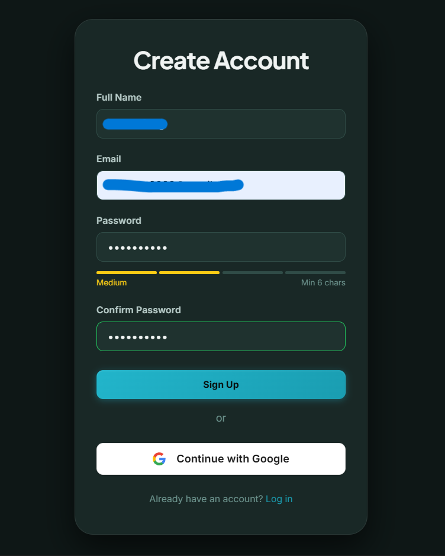
<figcaption><strong>Account Registration &amp; Security.</strong><br />
<br />
The centralized entry point bridging standard Firebase Authentication.
The interface enforces security through a real-time password strength
meter and offers a seamless Google OAuth alternative for frictionless
onboarding.</figcaption>
</figure>

To ensure trust within the hyper-local network, the platform enforces
strict identity verification. The process initiates at the **Create
Account** interface, securing user credentials via Firebase.

<figure id="fig:check_inbox" data-latex-placement="htbp">

<figcaption><strong>Secure Email Verification.</strong><br />
<br />
System directive enforcing an out-of-band email verification loop. The
interface provides immediate feedback regarding the masked delivery
address and includes a time-gated resend mechanism to prevent
spam.</figcaption>
</figure>

<figure id="fig:email_verification" data-latex-placement="htbp">

<figcaption><strong>Verification Success.</strong><br />
<br />
The conclusive confirmation interface. This state solidifies the user’s
authenticated digital footprint within the Firebase ledger, permitting
secure traversal into the primary application dashboard.</figcaption>
</figure>

Following registration, users are directed to check their inbox. The
subsequent **Email Verification** step ensures that only authenticated
actors can participate in the local social graph, thereby mitigating
sybil attacks and spam.

<figure id="fig:onboarding1" data-latex-placement="htbp">
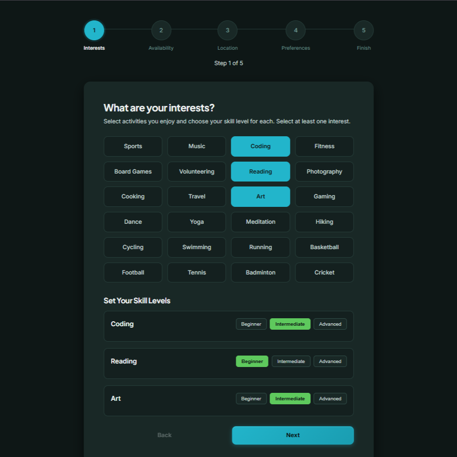
<figcaption><strong>Onboarding Step 1: Interests &amp;
Skills.</strong><br />
<br />
The initial data capture interface. Users define their semantic tags
(Interests &amp; Skills) and assign proficiency levels, establishing the
foundational heuristic for algorithmic matching.</figcaption>
</figure>

<figure id="fig:onboarding2" data-latex-placement="htbp">
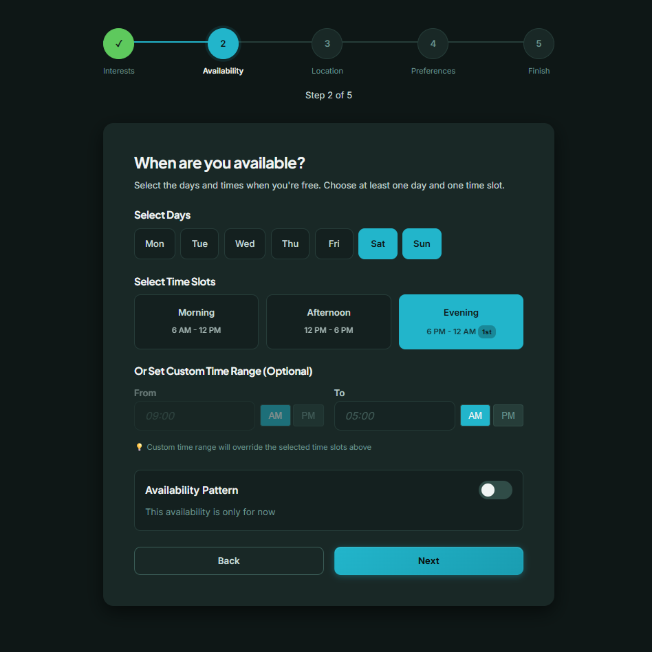
<figcaption><strong>Onboarding Step 2: Availability.</strong><br />
<br />
The temporal data capture interface. Users define their recurring weekly
availability matrix and preferred interaction time blocks, which are
critical for temporal compatibility matching.</figcaption>
</figure>

<figure id="fig:onboarding3" data-latex-placement="htbp">
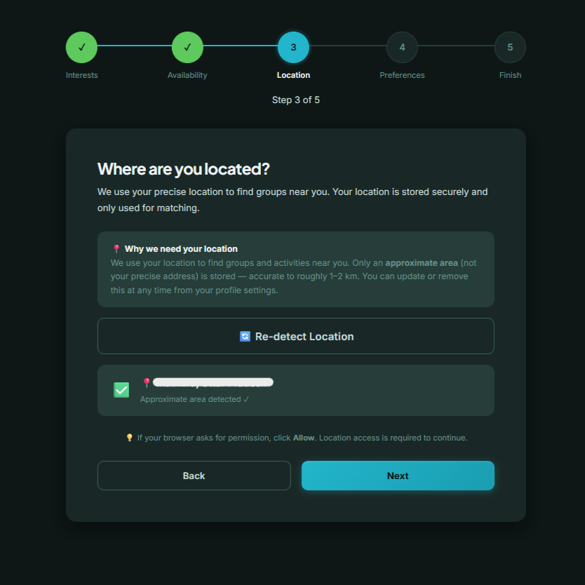
<figcaption><strong>Onboarding Step 3: Location.</strong><br />
<br />
The spatial data capture interface. Users establish their geographic
baseline, enabling the system to compute accurate, route-aware distance
decay models for hyper-local matching.</figcaption>
</figure>

<figure id="fig:onboarding4" data-latex-placement="htbp">
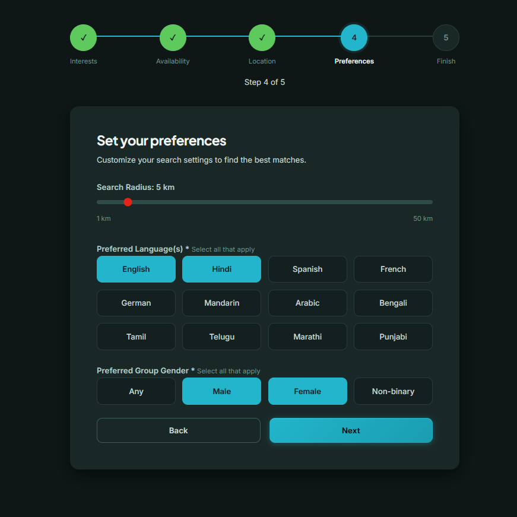
<figcaption><strong>Onboarding Step 4: Preferences.</strong><br />
<br />
Users establish programmatic hard filters by defining strict search
radii, language requirements, and preferred group
demographics.</figcaption>
</figure>

<figure id="fig:onboarding5" data-latex-placement="htbp">
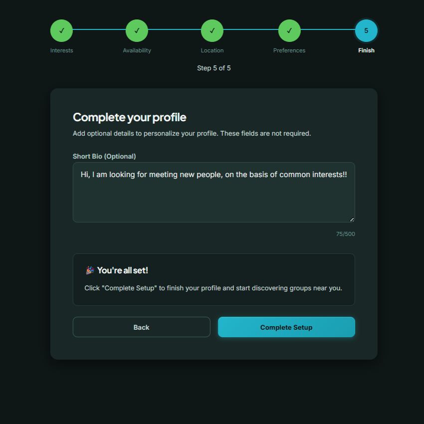
<figcaption><strong>Onboarding Step 5: Profile
Completion.</strong><br />
<br />
Finalization of the onboarding pipeline with optional semantic profile
data, activating the ranking engine.</figcaption>
</figure>

Following authentication, the system executes a mandatory multi-step
**Onboarding Pipeline**. This orchestrated flow captures the
foundational data required by the ranking engine. By organizing this
into individual steps (Interests, Availability, Location, Preferences,
and Profile Completion), the UI minimizes cognitive load while securely
compiling the complex baseline matrices necessary for intelligent
matching.

<figure id="fig:flowchart_onboarding" data-latex-placement="htbp">

<figcaption><strong>User Onboarding Sequence.</strong><br />
<br />
A continuous UML timeline detailing the asynchronous data collection
pipeline required to construct a valid temporal and spatial user
profile.</figcaption>
</figure>

The onboarding sequence is engineered as a strict, stateful sequence
pipeline to ensure data integrity prior to execution of the ranking
algorithm. As illustrated in the sequence diagram, the interaction spans
five distinct entities: the User, Client App, Firebase Auth, Firestore,
and the external Nominatim API. The flow initiates with credential
submission, where Firebase Auth executes an alternate (`alt`) evaluation
block; invalid credentials terminate the sequence (Step 4.1), while
successful validation permits state progression. The Client App then
sequentially requests semantic data (social preference tags), temporal
constraints (recurring free time blocks), and spatial baselines.
Notably, at Step 11, the Client App halts local progression to
asynchronously resolve the user's raw textual input into precise
geocoordinates via the Nominatim API. Only after compiling this
exhaustive spatial, temporal, and semantic payload (Step 14) is the
profile safely committed to Firestore, triggering the backend to toggle
the user state to 'Active' and authorizing Dashboard access.

**Backend Infrastructure and Services:**

- Firebase Firestore database for storing user groups and metadata

- Distance cache collection for storing OSRM routing results

- EmailJS integration for secure, automated status notifications without
  exposing raw contact data

- Optional Cloud Functions for data retention enforcement

## Real-Time Notification Architecture

To ensure immediate feedback for scheduling, ECA-Connect utilizes a
real-time Firestore listener architecture instead of relying on
traditional polling mechanisms. When a user requests to join a group, or
when a status changes (e.g., approval or rejection), a new document is
written to the `notifications` collection. The client application
maintains an active WebSocket connection to Firestore, executing a
callback to update notification badges instantly upon document creation.

To prevent unbound growth of the notification cache on the client and
excessive database reads, the `NotificationService` implements an
asynchronous auto-pruning heuristic: $$\begin{equation}
\text{Prune}(n) \iff (t_{\text{now}} - n.\text{createdAt}) > \Delta_{\text{max}}
\end{equation}$$ where $\Delta_{\text{max}} = 30 \text{ days}$. This
cleanup is executed as a non-blocking background task whenever the
notification feed is queried or updated, ensuring the read-path latency
remains unimpacted.

**In Plain English:** This formula simply states the rule for
automatically deleting old notifications to keep the app running fast.
It takes the current time ($t_{\text{now}}$) and subtracts the exact
time the notification was created ($n.\text{createdAt}$). If the result
is older than the maximum allowed age ($\Delta_{\text{max}}$, which is
set to 30 days), the system permanently deletes (prunes) that
notification.

## Double-Blind Join Request Workflow

The coordination pipeline employs a \"Double-Blind\" Join Request
workflow to mitigate unwanted solicitation. The workflow operates as
follows:

1.  **Initiation:** A user $u$ requests to join group $g$. The system
    records $u$'s intent but does not expose $u$'s raw contact details
    to the group creator $c$.

2.  **Review:** Creator $c$ receives an in-app notification and reviews
    $u$'s public profile (which contains generalized coordinates and
    broad interest tags).

3.  **Resolution:** If $c$ approves the request, the client application
    triggers the EmailJS proxy service. The system securely dispatches
    an email containing the private group link to $u$'s hidden email
    address without revealing it to $c$. Conversely, $c$'s email is
    never exposed to $u$.

## Accessibility and Social Graph Expansion

Recognizing that visual accessibility is crucial for broad adoption, the
platform implements a dual-theme architecture (Dark/Light mode). This
implementation adheres to WCAG AA contrast standards, dynamically
updating CSS custom properties without requiring a page reload.
Furthermore, to facilitate social graph expansion outside of the primary
geographical search radius, the system generates shareable Public
Profiles. These profiles utilize URL parameters to securely identify a
user, allowing external distribution of profiles while redacting exact
temporal availability to anonymous viewers.

<figure id="fig:flowchart_erd" data-latex-placement="htbp">

<figcaption><strong>Entity Relationship Diagram (ERD).</strong><br />
<br />
The NoSQL data model optimizing for rapid read/write operations mapping
Users to Groups via mediating Requests, alongside the isolated
distanceCache.</figcaption>
</figure>

The underlying data model is optimized for temporal state tracking and
relational efficiency within a NoSQL document environment. The schema
centers on the **users** collection (Primary Key: `uid`), which persists
critical geometric coordinates (`location_lat`, `location_lng`),
operational scalars (`radius`), and semantic arrays (`tags`,
`schedule`). The network graph is constructed via a one-to-many
relationship mapping creators to the **groups** collection. The 'groups'
entity encapsulates exhaustive event parameters, including geospatial
`routingAnchors` and algorithmically crucial temporal metrics like
`lastMessageAt` and float-based `attendanceScore` values. To preserve
the double-blind coordination architecture, the **requests** collection
acts as a mediating join table. It maps the many-to-many relationship
between participants and events, tracking the `status` and precise
`updatedAt` timestamps to manage the lifecycle of a join request. An
isolated **distanceCache** collection maps unique `hashId` primary keys
to computed `distanceMeters`. This structural isolation allows
aggressive Time-To-Live (TTL) pruning on cached routes without impacting
core user architecture.

**Routing Engine:**

- OSRM API used for route-aware distance calculation

- Haversine distance used as fallback for routing failures

- Route results cached for 7 days to reduce repeated API calls

## Operational Parameters

- Availability granularity: 1 minute resolution

- OSRM timeout: 5000 ms

- Cache Time-To-Live: 7 days

- Code default radius fallback: 50 km

- Recommended operational radius: 10--20 km

The system returns the top-K compatible groups ranked by the
compatibility score defined in the following section.

# Formal Definitions

Let $u$ denote a user and $g$ denote a candidate group.

- $availability_u$: set of minute indices when user $u$ is available

- $event_g$: set of minute indices covered by event $g$

- $d_{osrm}(u,g)$: route distance from OSRM in meters

- $d_{hav}(u,g)$: Haversine distance in meters

- $R$: maximum matching radius in meters

- $tags_u$: set of user interest tags

- $tags_g$: set of group interest tags

## Time Overlap Score

Time overlap measures the fraction of the event duration that lies
within the user's available time window.

$$\begin{equation}
T(u,g) = \frac{|availability_u \cap event_g|}{|event_g|}
\end{equation}$$

where $T(u,g) \in [0,1]$.

**In Plain English:** This calculates how much of the group's event fits
into the user's free time. It looks at the exact minutes the user is
free ($availability_u$) and finds where that overlaps ($\cap$) with the
exact minutes the event is happening ($event_g$). It then divides that
overlapping time by the total length of the event. A score of 1 means
the user is free for the entire event, while a lower score means they
might have to arrive late or leave early.

## Distance Score

Distance score models travel feasibility using linear distance decay.

$$\begin{equation}
D(u,g) = \max \left(0,\; 1 - \frac{d(u,g)}{R} \right)
\end{equation}$$

where

$$d(u,g)=
\begin{cases}
d_{osrm}(u,g) & \text{if OSRM succeeds} \\
d_{hav}(u,g) & \text{otherwise}
\end{cases}$$

**In Plain English:** This converts physical travel distance into a
score between 0 and 1. It compares the actual travel distance to the
group ($d(u,g)$) against the user's maximum allowed travel radius ($R$).
If the group is right next door (0 distance), the score is a perfect 1.
As the distance increases toward the user's maximum limit, the score
drops down toward 0. If the group is further than the maximum radius,
the score just stays at 0 (enforced by the $\max$ function).

<figure id="fig:group_page" data-latex-placement="htbp">
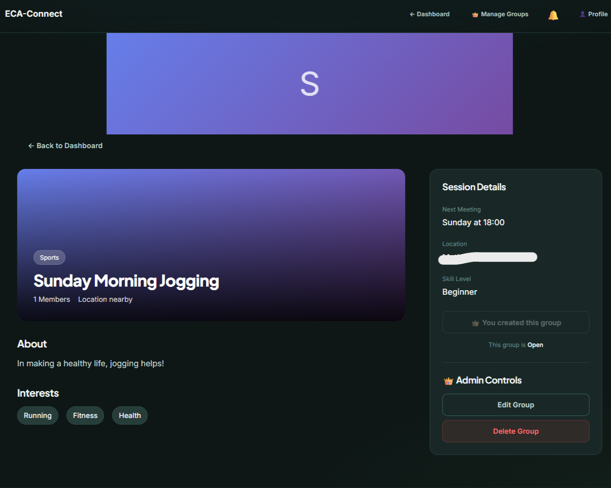
<figcaption><strong>Detailed Event Interface.</strong><br />
<br />
The comprehensive group overview state. This interface renders the
aggregated temporal schedule, specific skill requirements, and the
geographic routing anchor, alongside creator-exclusive administrative
controls for localized event mutation.</figcaption>
</figure>

Upon selecting an event from the dashboard, the **Group Page** exposes
granular logistical metrics. It translates the raw OSRM route data into
actionable distance constraints and temporal travel estimates, ensuring
users make informed local commitments before initiating a join request.

## Interest Score (intuitive)

We measure interest similarity by counting exact tag matches and
normalizing by the number of tags the user provided. This follows the
implementation in the codebase.

$$\begin{equation}
I(u,g) \;=\; \frac{|\mathrm{tags}_u \cap \mathrm{tags}_g|}{|\mathrm{tags}_u|},\qquad I\in[0,1].
\end{equation}$$

**Note (asymmetry).** This score emphasizes how well a group's tags
cover the user's stated interests. If you prefer a symmetric measure,
replace the above with Jaccard similarity: $$\begin{equation}
I_{\mathrm{Jaccard}}(u,g) \;=\; \frac{|\mathrm{tags}_u \cap \mathrm{tags}_g|}{|\mathrm{tags}_u \cup \mathrm{tags}_g|}.
\end{equation}$$

**In Plain English:** This checks how well the group's topics match what
the user actually cares about. It takes the specific interest tags
chosen by the user ($\mathrm{tags}_u$) and sees how many of those exact
tags the group also has ($\cap$). It divides that number of matches by
the total number of interests the user selected. For example, if the
user picks 4 interests and the group matches 3 of them, the score is
$3/4$ or $0.75$.

## Group Health Score (simple)

Group health summarizes recent participation and activity into a single
score in $[0,1]$. Compute it in three steps.

#### 1. Recency-weighted attendance

Let $a_i$ be the attendance fraction for the $i$-th most recent event
(oldest to newest), and set recency weights
$$\rho_i = e^{-\gamma (N-i)}$$ for $i=1,\dots,N$. The recency-weighted
attendance is
$$A_g = \frac{\sum_{i=1}^{N} \rho_i a_i}{\sum_{i=1}^{N} \rho_i}.$$

#### 2. Normalized message activity

Let $\bar{m}$ be the mean messages per event and $M_{\max}$ a chosen cap
(e.g., 100). Then
$$M_{\mathrm{norm}} = \frac{\min(\bar{m},M_{\max})}{M_{\max}} \in [0,1].$$

#### 3. Final health score

Combine the components with fixed weights (defaults chosen for
interpretability): $$\begin{equation}
H_g = 0.6\,A_g + 0.3\,M_{\mathrm{norm}} + 0.1\,R_g,
\end{equation}$$ where $R_g$ is an additional recency/decay factor
(e.g., $R_g=\exp(-(t_{\text{now}}-t_{\text{last}})/\tau)$).

**In Plain English:** The Health Score indicates if a group is actually
active or \"dead.\" It combines three things: 1. **Attendance ($A_g$):**
Do people actually show up to the events? (This makes up 60% of the
health score). 2. **Messages ($M_{\mathrm{norm}}$):** Are people
chatting in the group? (Makes up 30%). 3. **Recency ($R_g$):** How
recently did they last interact? (Makes up the final 10%). A high health
score tells a new user that the group is vibrant and worth joining.

<figure id="fig:profile" data-latex-placement="htbp">

<figcaption><strong>User Configuration Matrix.</strong><br />
<br />
The central identity module. Users interact with this interface to
dynamically mutate their semantic tags (Interests &amp; Skills), adjust
their spatial heuristic boundaries (Radius), and dictate strict social
preferences (Languages &amp; Gender) for downstream algorithmic
processing.</figcaption>
</figure>

<figure id="fig:reset_password" data-latex-placement="htbp">

<figcaption><strong>Privacy &amp; Security Configuration.</strong><br />
<br />
The administrative control surface. This interface allows participants
to enforce cryptographic password mutations, while additionally
dictating the visibility exposure of their dynamic availability matrix
and spatial coordinates to downstream network members.</figcaption>
</figure>

The platform recognizes that user circumstances are dynamic. The
**Profile Management** interface allows continuous updates to distance
radii, hard filters, and base locations, instantly re-triggering the
client-side recommendation engine upon save. Paired with this is the
**Reset Password** configuration, enforcing continuous account security.
This interface also serves as the control layer for the platform's
WCAG-compliant Dark/Light mode theme engine.

## Dynamic Time Filter Override

While users maintain a baseline operational schedule ($availability_u$),
the ranking mathematically allows for situational overrides to
accommodate temporary shifts in free time. When a user applies a custom
time filter $W_{\text{custom}}$, the ranking engine performs a
substitution: $$\begin{equation}
availability_u' = 
\begin{cases} 
W_{\text{custom}} & \text{if } W_{\text{custom}} \neq \emptyset \\
availability_u & \text{otherwise}
\end{cases}
\end{equation}$$ The Time Overlap score $T(u,g)$ is subsequently
strictly evaluated against $availability_u'$.

**In Plain English:** This represents the \"Custom Time Filter\" feature
on the dashboard. Normally, the system uses the user's standard weekly
schedule ($availability_u$). However, if the user manually overrides
this by selecting a specific free block on the dashboard today
($W_{\text{custom}}$), the system instantly safely ignores their normal
schedule and temporarily replaces it with this new, customized time
frame ($availability_u'$).

## Advanced Hard Constraints

Before the multi-variable Compatibility Score is calculated, the system
prunes candidates using strict Boolean logic to optimize computational
efficiency and ensure non-negotiable requirements are met:

- **Strict Skill Matching:** Let $s_u \in \{1,2,3\}$ be the user's
  categorized skill level and $s_g$ be the required group skill level.
  If strict matching is active, $g$ is pruned if $s_u < s_g$.

- **Privacy Gating:** If candidate group $g$ is marked `private`, it is
  pruned from the public candidate pool unless user $u$ is
  cryptographically verified via Firestore rules as an existing member.

## Compatibility Score

All components are normalized to $[0,1]$. The final compatibility score
is computed as:

$$\begin{equation}
\begin{aligned}
Compatibility(u,g) &= 100 \times \Big( 
0.40I + 0.30T + 0.15D \\
&\quad + 0.07H + 0.05S + 0.03R
\Big)
\end{aligned}
\end{equation}$$

where

- $I$ = Interest score

- $T$ = Time overlap

- $D$ = Distance score

- $H$ = Group health

- $S$ = Group size factor (Skill level alignment in implementation)

- $R$ = Recency factor (Text relevance in implementation)

**In Plain English:** This is the master formula that generates the
final \"Match Percentage\" (0-100%) a user sees on their dashboard. It
takes all the individual scores we calculated above (Interest, Time,
Distance, Health, Skill, and Text Relevance) and multiplies them by
their specific importance weights. Because Interest (40%) and Time (30%)
are the most important factors for making real-world connections, they
heavily drive the final percentage, while smaller factors like Group
Health (7%) or matching the search text (3%) act as slight boosts to
push the best groups to the top.

## Tie-breaking Strategy

If two candidate groups receive identical compatibility scores (within
$\epsilon = 10^{-6}$), the system prioritizes:

1.  Higher Time Overlap score

2.  Lower travel distance

3.  Higher Group Health score

4.  Higher number of participants

# Ranking Engine: Algorithm and Complexity

## Algorithm (Pseudocode)

The ranking engine executes lightweight client-side filtering followed
by feature computation and scoring. Before scoring, the engine applies a
series of robust hard filters, evaluating factors such as strict skill
matching, dynamic temporal overrides (allowing users to temporarily
switch availability without updating their base profile), language
constraints, and exact privacy gating to ensure strict candidate
pruning. The following pseudocode mirrors the production
`ranking-engine-fixed.js` logic.

``` {.JavaScript language="JavaScript" caption="Ranking engine pseudocode (client-side)." basicstyle="\\ttfamily\\small"}
Input: user_u, availability_u, location_u, user_radius_R (km or null), candidate_groups, K
Constants: CACHE_TTL_MS = 7*24*60*60*1000  # 7 days
           OSRM_TIMEOUT_MS = 5000         # 5 seconds
           DEFAULT_RUNTIME_RADIUS_KM = 50 # code fallback; recommend 10-20

R = (user_radius_R or DEFAULT_RUNTIME_RADIUS_KM) * 1000  # meters

candidates = apply_hard_filters(candidate_groups, user_u, filters)  # skill, dynamic time, privacy, language
scored = []
for g in candidates:
    d_hav = haversine_meters(u.location, g.location)
    if d_hav > R: continue  # cheap pre-filter

    key = hash_coords(u.location, g.location)
    if distance_cache.exists(key) and not distance_cache.is_expired(key, TTL=CACHE_TTL_MS):
        d = distance_cache.get(key)
    else:
        try:
            d = osrm_route_distance_meters(u.location, g.location, timeout=OSRM_TIMEOUT_MS)
        except TimeoutOrError:
            d = d_hav
        distance_cache.set(key, d, timestamp=now)

    if d > R: continue

    I = calculateInterestScore(u.tags, g.tags)            # matched/user.tags
    T = getTimeWindowOverlap(u.availability, g.schedule)  # minutes overlap / event_minutes
    D = max(0, 1 - d / R)
    H = computeGroupHealth(g)
    S = computeSizeFactor(g)
    Rrec = computeRecencyFactor(g)

    score = 100 * (0.40*I + 0.30*T + 0.15*D + 0.07*H + 0.05*S + 0.03*Rrec)
    scored.append((g, score, T, d, H))

sort scored by score descending (tie-break: higher T, lower d, higher H)
return top K entries
```

## Complexity Analysis (plain explanation)

We estimate how costly the ranking step is, so implementers can choose
appropriate optimizations.

#### What each cost means (simple)

- **Per-candidate work (O(1)):** For each candidate group the client
  performs a small, fixed amount of work (compute interest overlap, time
  overlap, etc.). Occasionally it also issues an OSRM call to get a
  routed distance; that network call takes extra time but does not
  change the per-candidate algorithmic complexity.

- **Sorting (O($N\log N$) vs O($N\log K$)):** If we compute scores for
  all $N$ candidates and then sort them completely, the dominant cost is
  $O(N\log N)$. If we only need the top-$K$ results (and $K \!\ll\! N$),
  it is much more efficient to maintain a bounded min-heap of size $K$
  while scanning candidates --- this gives $O(N\log K)$ time and avoids
  a full sort.

- **OSRM calls (up to $O(N)$):** In the worst case we might need a route
  request for every candidate, which is $O(N)$ network requests. In
  practice, the number of OSRM calls is far lower because we first apply
  cheap filters (Haversine pre-filter) and use a route result cache to
  avoid repeated queries.

#### Practical guidance

1.  **Use a Haversine pre-filter:** compute straight-line distance first
    (very cheap) and discard candidates whose straight-line distance
    exceeds the matching radius. This reduces how often you call OSRM.

2.  **Prefer top-$K$ heap when $K$ is small:** if you only show a few
    results (e.g., $K=5$), using a min-heap reduces sorting cost
    substantially compared to sorting the entire list.

3.  **Cache and batch OSRM calls:** store recent route results (with
    TTL) and batch requests where possible to reduce network overhead
    and rate-limit risk.

4.  **Precompute heavy features:** expensive or historical features
    (e.g., Group Health) can be computed on the backend and stored in
    group metadata so the client only reads a small number per
    candidate.

In summary: the algorithm is linear in the number of candidates for
feature computation, and sorting or heap use determines whether the
overall cost is $O(N\log N)$ or the cheaper $O(N\log K)$. With Haversine
pre-filtering and caching, the practical runtime and network cost are
typically much lower than these worst-case bounds.

<figure id="fig:flowchart_ranking" data-latex-placement="htbp">

<figcaption><strong>Ranking Engine Sequence.</strong><br />
<br />
The deterministic algorithmic pipeline illustrating hard filter
initializations, fault-tolerant geospatial routing, and parallel
heuristic scoring computations.</figcaption>
</figure>

The Ranking Engine executes a sophisticated, synchronous pipeline
optimized for minimal Time-to-First-Byte latency on the client. As
detailed in the sequence diagram, execution begins by fetching the raw
candidate pool from Firebase. The engine immediately applies
deterministic Hard Filters (language, privacy, skill) to aggressively
prune the search space ($N$). Surviving candidates enter a critical
geospatial evaluation loop utilizing an `alt` block for cache mediation.
The system queries the local Distance Cache; a cache hit immediately
returns the temporal distance, whereas a miss forces an asynchronous
fetch to the external OSRM API. Crucially, this external request is
protected by an `opt` fault-tolerance block: if OSRM times out, the
engine executes a mathematical fallback to the Haversine formula,
ensuring continuous operation. Following spatial pruning by maximum
radius, the engine enters a parallel execution phase (`par`). Component
scores for Interest Overlap, Time Overlap, Distance Decay, and Group
Health are concurrently calculated. These vectors are unified into a
final synthesized Compatibility Score, subjected to a deterministic
tie-breaking routine, and pushed to the Dashboard for rendering.

<figure id="fig:dashboard" data-latex-placement="htbp">
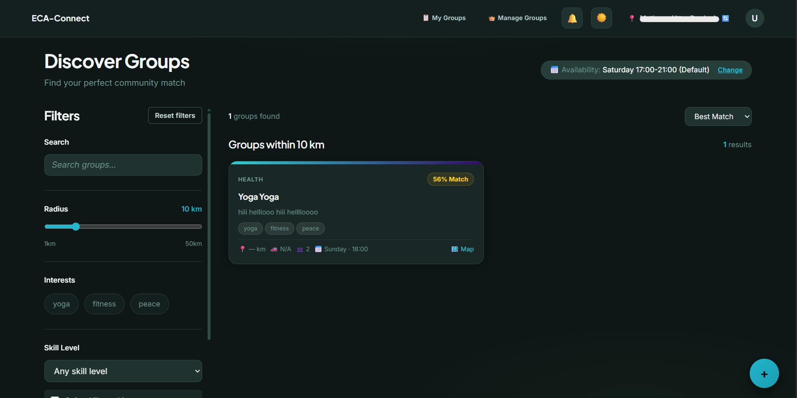
<figcaption><strong>The Discover Dashboard.</strong><br />
<br />
The primary heuristic interface. Users manipulate dynamic spatial radii,
semantic interests, and skill filters on the left, instantly
re-rendering the algorithmic Compatibility Score (Match %) and Group
Health metrics on the candidate cards.</figcaption>
</figure>

The localized **Dashboard** serves as the primary consumption interface,
dynamically rendering the output of the Intelligent Ranking Engine.
Cards are strictly ordered by their mathematically derived Compatibility
Score (0-100%), instantly reflecting any active hard filters or dynamic
temporal overrides invoked by the user.

# Simulated Experiments: Setup and Protocol

Because the system is new and there are no live logs, we evaluate using
reproducible synthetic simulations. The simulation pipeline is designed
to be deterministic (seeded RNG) and parameterized so results can be
replicated.

## Simulation dataset generation

#### Geographic model

- **Urban scenario:** $U_{urban}=2000$ users, $G_{urban}=1000$ groups.
  Locations sampled from a mixture of Gaussian clusters with standard
  deviation 500--1500 m to emulate dense neighborhoods.

- **Suburban / Rural scenario:** $U_{rural}=800$ users, $G_{rural}=400$
  groups. Locations sampled uniformly across a larger bounding box (tens
  of kilometers).

- **Mixed scenario:** Combine urban clusters with peripheral sparse
  zones to stress-test the radius and fallback logic.

#### Availability and tags

- Tag vocabulary size: $V=50$ tags.

- Each user and group receives $3$--$7$ tags sampled without replacement
  from $V$.

- Availability: for each user, sample 1--4 recurring weekly blocks of
  length uniformly distributed between 30 and 240 minutes; represent at
  1-minute granularity.

#### Group metadata

- Historical attendance for past $N=5$ events simulated as random draws
  from Beta distributions parametrized to mimic active vs inactive
  groups.

- Messages per event $m_i$ sampled from a capped Poisson ($\lambda$)
  distribution; apply $M_{max}=100$ cap as in formula.

- Current interested counts: sample from small integers (1--50) to
  produce realistic $S_g$.

#### Behavioral attendance model

To synthesize ground truth \"attend\" labels, define a probabilistic
model: $$\begin{equation}
p_{\text{attend}}(u,g) = \sigma(\beta_0 + \beta_T T(u,g) + \beta_D (1 - d(u,g)/R) + \beta_I I(u,g)),
\end{equation}$$ where $\sigma(x)=1/(1+e^{-x})$ is the logistic
function. Choose parameter sets to reflect different user sensitivities:

- Time-sensitive users: $(\beta_T,\beta_D,\beta_I)=(3.0,1.0,1.0)$

- Distance-sensitive users: $(1.0,3.0,1.0)$

- Balanced users: $(1.5,1.5,1.5)$

Sample binary attendance by Bernoulli draws with probability
$p_{\text{attend}}$.

## Experiment protocol

1.  For each scenario (urban, rural, mixed) and each user-behavior
    parameterization, generate dataset with fixed random seed.

2.  For each user, run the ranking engine to produce top-$K$ (e.g.,
    $K=5$) recommendations using the heuristic weights.

3.  Compare recommendations with simulated ground-truth attendance;
    compute metrics defined below.

4.  Repeat grid search over weight variations (coarse grid) to evaluate
    sensitivity and identify best-performing weight sets under each
    scenario.

5.  Run ablation experiments by zeroing each feature weight in turn and
    observing metric impact.

# Evaluation Metrics

We evaluate both ranking quality and system-level operational metrics.

## Rank-quality metrics (simple explanation)

We evaluate whether the top-$K$ recommendations actually match events
users attend.

#### Precision@K (simple)

For each user we ask: of the $K$ items recommended, how many did the
user attend? We average this fraction over all users.

$$\begin{equation}
\mathrm{Precision@}K \;=\; \frac{1}{|U|}\sum_{u\in U} \frac{|\mathrm{Rec}_u[1:K] \cap \mathrm{Attended}_u|}{K},
\end{equation}$$ where $\mathrm{Rec}_u[1:K]$ denotes the top-$K$
recommendations for user $u$.

#### Recall@K (simple)

For each user we ask: of the events the user actually attended, what
fraction appeared in our top-$K$ list? We average this fraction across
users. We add a tiny constant $\epsilon$ in the denominator to avoid
division by zero when a user attended no events.

$$\begin{equation}
\mathrm{Recall@}K \;=\; \frac{1}{|U|}\sum_{u\in U} \frac{|\mathrm{Rec}_u[1:K] \cap \mathrm{Attended}_u|}{|\mathrm{Attended}_u| + \epsilon},
\end{equation}$$ with $\epsilon=10^{-6}$.

#### NDCG@K (intuition)

Normalized Discounted Cumulative Gain rewards recommendations that place
attended events higher in the ranked list. We use binary relevance (1 if
attended, 0 otherwise) and compute NDCG@K in the standard way to capture
rank-aware quality.

## Operational metrics

#### Average expected travel time

average OSRM/Haversine-derived travel time for top-K recommendations.

#### OSRM call rate

Average number of OSRM calls per user query (cache misses). Also compute
fallback rate:
$$\text{FallbackRate} = \frac{\text{number of queries using } d_{hav}}{\text{total distance computations}}.$$

#### Latency

Median and 95th percentile client-side ranking time (ms) including OSRM
waits (where OSRM blocking occurs), measured under synthetic network
delay assumptions.

# Baselines and Ablation Study

## Baselines

We compare the proposed Compatibility ranking to three baseline
strategies:

1.  **Interest-only:** rank by $I(u,g)$ descending.

2.  **Distance+Interest (naive):** weighted sum
    $\alpha I + (1-\alpha) (1 - d_{hav}/R)$ with $\alpha=0.5$.

3.  **Time-first:** rank by $T(u,g)$ descending, break ties by $I(u,g)$.

## Ablation study

For each feature $f\in\{I,T,D,H,S,R\}$ perform:

1.  Set weight $w_f = 0$ and renormalize remaining weights
    proportionally or keep others fixed (report both variants).

2.  Re-run the experiment suite and record metric changes (Precision@K,
    Recall@K, NDCG@K).

3.  Plot metric delta vs removed feature to quantify importance of each
    feature.

## Weight grid search (coarse)

Define a coarse simplex grid for $(w_I,w_T,w_D)$ while keeping smaller
features proportionally as in the baseline (or allow full 6-D grid for a
more exhaustive search when computationally feasible). For each
candidate weight vector:

1.  Run the simulated experiments across scenarios.

2.  Record average Precision@K and expected travel time.

3.  Select the Pareto-front of weight vectors that balance precision and
    travel time.

# Privacy, Consent, and Data Retention

Protecting user privacy is a fundamental design principle in
ECA-Connect. Since the platform relies on location data and user
availability, the system incorporates privacy-by-design strategies to
minimize exposure of sensitive information.

<figure id="fig:flowchart_privacy" data-latex-placement="htbp">

<figcaption><strong>Double-Blind Lifecycle Sequence.</strong><br />
<br />
The Privacy-by-Design workflow enforcing mutual consent through coarse
location sharing and asynchronous, mediated approval gates.</figcaption>
</figure>

To practically enforce Privacy-by-Design principles, interaction between
unacquainted nodes in the network is gated by a strict, asynchronous
lifecycle. The sequence diagram outlines the interaction between two
disparate actors: the Creator and the Applicant. The flow is partitioned
by the Firestore operational boundary. When an applicant utilizes the
Ranking Engine to discover an event initialized by a Creator, the system
explicitly returns only \"coarse location data\" (Step 4), redacting
exact coordinates. Upon submitting a join request, the interaction
transitions to a mediation phase. The backend securely logs the intent
and triggers the Notification Service to asynchronously alert the
Creator (Step 8). The workflow hinges on the Creator's manual review of
the Applicant's profile, resolving at a critical `alt` decision block. A
rejection cleanly terminates the interaction loop via a notification. An
acceptance systematically mutates the group document, appending the
Applicant to the `members array` and subsequently granting them
authorized access to the private, non-obfuscated coordinate details.
This sequence ensures cryptographic consent is achieved before any
sensitive data crosses the trust boundary.

<figure id="fig:create_group1" data-latex-placement="htbp">
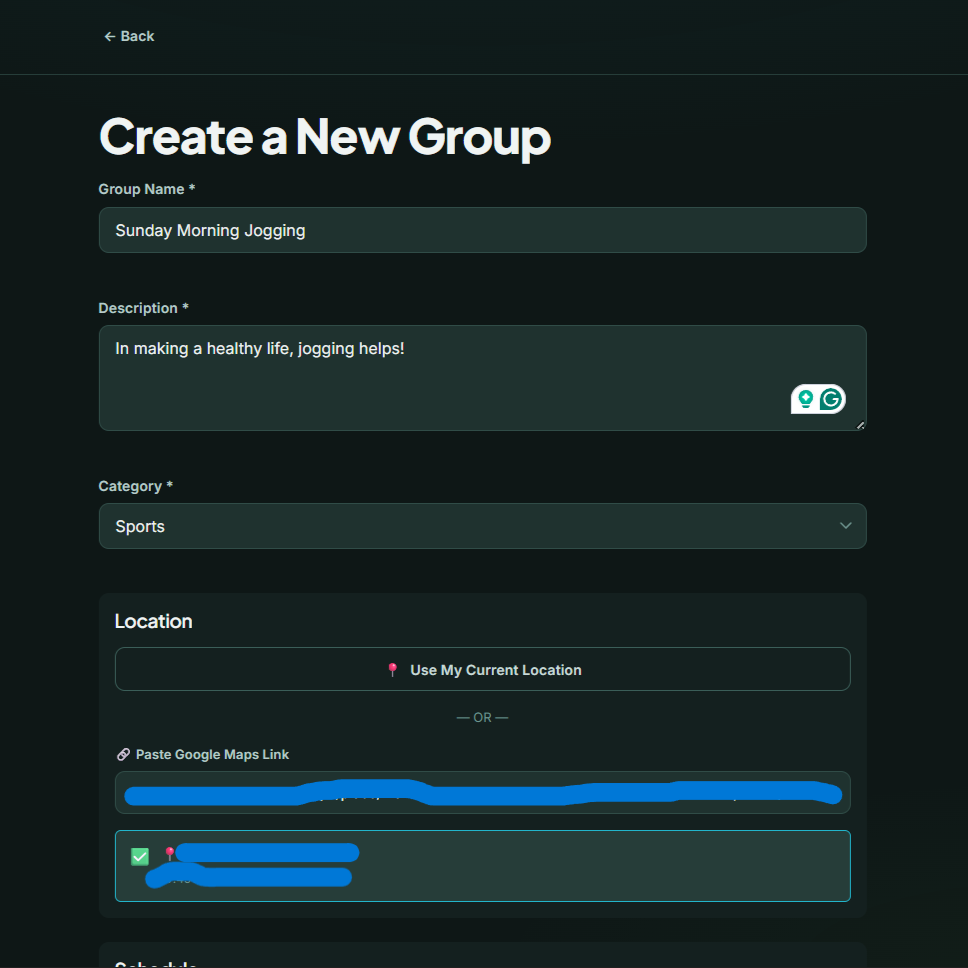
<figcaption><strong>Group Initialization: Metadata &amp;
Location.</strong><br />
<br />
Founders establish the foundational identity of the group. The interface
enforces the input of core metadata (Name, Category) and captures
precise spatial constraints via an automated geolocator or manual Google
Maps parsing.</figcaption>
</figure>

<figure id="fig:create_group2" data-latex-placement="htbp">
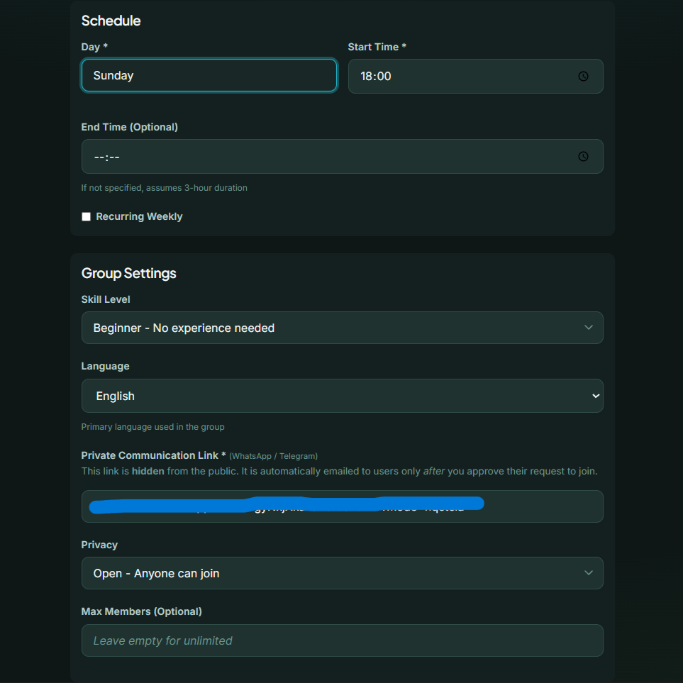
<figcaption><strong>Group Initialization: Schedule &amp;
Privacy.</strong><br />
<br />
Founders establish temporal anchors (recurring weekly time slots) and
define strict moderation constraints, including capacity limits,
required skill levels, and the obfuscated private communication
link.</figcaption>
</figure>

Founders utilize the **Create Group** wizard to establish the spatial
and temporal anchors of an event. This interface enforces explicit
configurations constraints---such as defining rigid bounds for required
skill levels and setting exact coordinate data. By enforcing these
parameters at the point of creation, the system ensures that the
downstream ranking algorithms possess non-ambiguous data ($T_g$, $W_g$)
for precise heuristic matching.

## Data Collection

The system stores the following information:

- User availability windows

- Interest tags

- Optional user coordinates

- Group location coordinates

- Cached OSRM routing results

All data is stored using Firebase Firestore.

<figure id="fig:request_join" data-latex-placement="htbp">
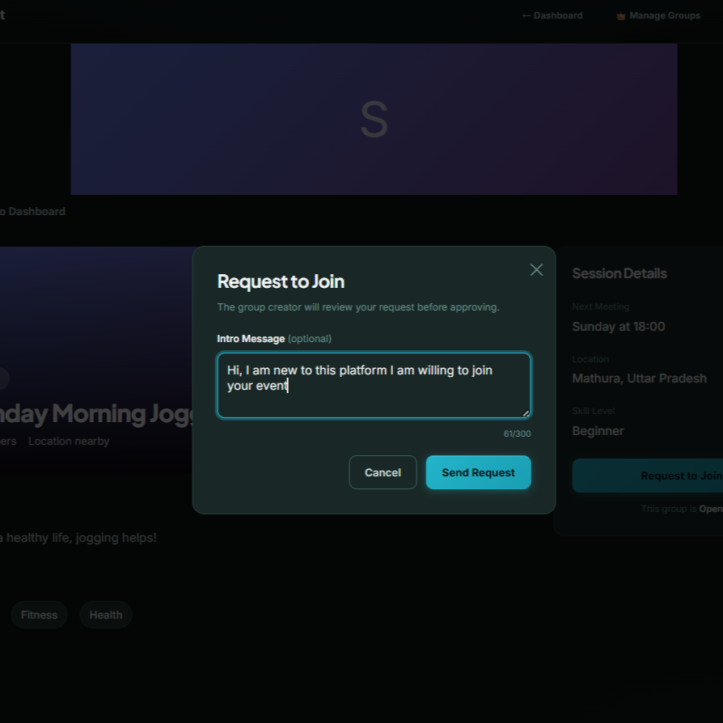
<figcaption><strong>Asynchronous Coordination Request.</strong><br />
<br />
The applicant initializes a double-blind join request. The modal permits
the inclusion of an optional semantic introduction while strictly
obfuscating raw contact credentials and exact location coordinates from
the group creator.</figcaption>
</figure>

The coordination layer operates on a double-blind, consent-first
architecture. An applicant initiates contact via the **Request to Join**
interface, which deliberately obfuscates their precise location.

## Consent and Visibility

Precise location sharing requires explicit user consent. By default, the
platform presents only coarse location information (rounded to
approximately 500 meters) when displaying group cards. Exact coordinates
are revealed only when users explicitly join a group or accept an
invitation.

Private groups enforce access restrictions through membership
verification checks before revealing group information.

<figure id="fig:notifications" data-latex-placement="htbp">
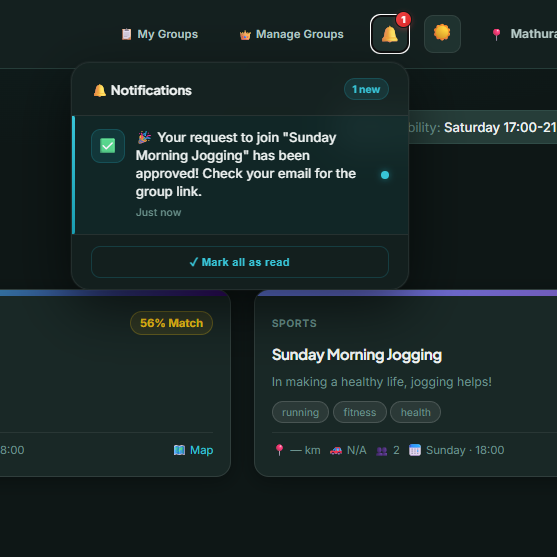
<figcaption><strong>Real-Time Notification Hub.</strong><br />
<br />
The WebSocket-driven alert center. This interface provides immediate,
asynchronous feedback regarding critical state changes, such as the
cryptographic approval of a join request and the dispatch of secure
routing links.</figcaption>
</figure>

This request instantly triggers the real-time Firestore WebSocket
listener, resulting in an immediate alert in both the creator's and the
applicant's **Notifications** panel. This architecture decouples the
expression of intent from the exposure of raw contact data until formal
approval is granted.

<figure id="fig:group_manager" data-latex-placement="htbp">
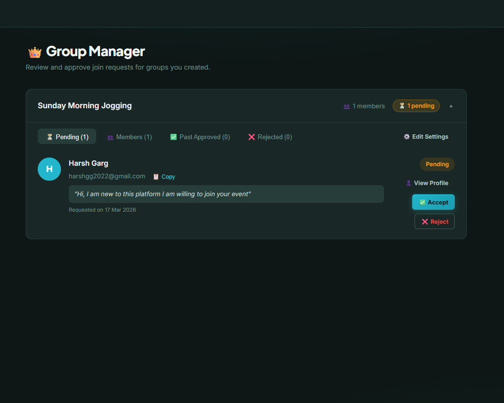
<figcaption><strong>Group Management Console.</strong><br />
<br />
The centralized administrative hub. Creators utilize this secure
interface to resolve privacy gates, triaging pending applicant requests
(accept/reject) while reviewing aggregated backend membership
data.</figcaption>
</figure>

The **Group Manager** interface acts as the decentralized moderation hub
for creators. It provides a centralized view of pending, approved, and
rejected applicants. Here, privacy gating logic is resolved: a creator's
explicit acceptance via this interface is required before the system
triggers the EmailJS proxy service, facilitating the secure, out-of-band
exchange of exact meeting coordinates and unlocking private group
interactions.

## Secure Communication and Field-Level Security

To facilitate seamless real-world coordination without compromising user
privacy, ECA-Connect integrates a secure email proxy layer. When a user
requests to join a group, or when a manager approves or rejects a
request, automated email notifications are dispatched. This architecture
deliberately obfuscates direct email addresses---neither the group
manager nor the applicant are exposed to each other's raw contact
information until they deliberately choose to interact within the
group's private channels. This ensures a double-blind communication
layer that protects user identity during the initial coordination
phases.

Crucially, implementing this capability required careful database
security modeling. While the `joinRequests` document must store the
`requesterEmail` to allow the client to trigger the EmailJS proxy upon
approval, this field represents a significant privacy vulnerability if
exposed globally. Consequently, the Firestore Security Rules are
engineered to apply field-level access control. The rule logic dictates:

``` {.JavaScript language="JavaScript" basicstyle="\\ttfamily\\small"}
match /joinRequests/{request} {
  allow read: if request.resource.data.requesterId == request.auth.uid 
              || request.resource.data.creatorId == request.auth.uid;
}
```

This strict isolation ensures that the sensitive payload is exclusively
routed between the bounded context of the requester and the explicit
group creator, making the `requesterEmail` entirely opaque to
unauthorized participants on the network.

## Data Retention

To prevent unnecessary long-term storage of sensitive information, the
following retention policy is recommended:

- User coordinates retained for a maximum of 30 days

- OSRM route cache retained for 7 days (matching system TTL)

- Aggregated anonymized analytics retained for up to 12 months

These deletions can be enforced through Firestore TTL policies or
scheduled Firebase Cloud Functions.

## Privacy-Preserving Techniques

The system applies several privacy-preserving techniques:

- Hashing of route cache keys to avoid storing raw coordinates

- Optional coarse location sharing

- Ephemeral coordinate sharing during active group participation

- User-controlled data deletion and export

These mechanisms align with established privacy-by-design principles
discussed in prior research [@rest2014privacy; @dwyer2008privacy].

# Limitations

While ECA-Connect provides a structured approach to availability-based
social matching, several limitations remain.

- **Lack of real-world data:** The evaluation is based on synthetic
  simulations rather than real user behavior.

- **Heuristic weights:** Current compatibility weights are design-based
  and require empirical tuning once real usage data becomes available.

- **Routing dependency:** The system relies on OSRM services which may
  occasionally fail or timeout, forcing fallback distance estimates.

- **Device computation:** Client-side ranking may increase processing
  load on low-end mobile devices.

- **Interest matching simplicity:** Exact tag matching may fail to
  capture semantic similarity between related interests.

Addressing these limitations will require real-world deployment,
continuous monitoring, and model improvements.

# Future Work

Several directions exist for improving the ECA-Connect system.

- Deployment of pilot studies with real users to collect interaction and
  attendance data.

- Learning optimal compatibility weights using supervised machine
  learning.

- Incorporating semantic embeddings for interest similarity rather than
  exact tag matching.

- Introducing trust signals such as user verification and reputation
  scores.

- Optimizing client-side computation to reduce mobile battery usage.

Additionally, future work may explore adaptive radius selection
depending on urban density and transportation infrastructure.

# Author Contributions {#author-contributions .unnumbered}

The development and evaluation of the ECA-Connect platform was a
collaborative effort among the student authors. The specific
contributions are outlined as follows:

- **Harsh Garg:** Led the frontend development, focusing on implementing
  the responsive vanilla JavaScript interfaces, dynamic dashboard
  filtering, and the client-side execution environment for the
  Intelligent Ranking Engine.

- **Riddhi Bhisikar:** Spearheaded the integration between the
  client-side frontend and the Firestore backend, formulating the data
  flow architecture and ensuring seamless state management across the
  application.

- **Vipul Gupta:** Directed the backend infrastructure design, managing
  the Firebase configuration, Firestore NoSQL schema, and the
  implementation of the secure caching mechanisms for third-party API
  results.

- **Pari Agrawal:** Managed the User Experience (UX) and visual design,
  ensuring intuitive onboarding flows, accessible visual hierarchies,
  and the clear presentation of complex geospatial and temporal data on
  the group dashboards.

- **Nitin Chaturvedi:** Oversaw DevOps operations, third-party API
  integrations (OSRM), repository management, and the theoretical
  documentation of the system's mathematically-driven methodology.

# Conclusion

This paper introduced ECA-Connect, an availability-first social matching
platform that integrates temporal compatibility, geographic feasibility,
and interest similarity into a unified compatibility score. Unlike
traditional social platforms that prioritize interest similarity alone,
ECA-Connect explicitly models scheduling feasibility and route-aware
distance, increasing the likelihood that online matches translate into
real-world interactions.

The proposed architecture leverages client-side ranking, OSRM-based
routing, and privacy-by-design principles to provide a scalable and
user-conscious recommendation framework. Because real user data is not
yet available, the paper provides a comprehensive simulation-based
evaluation methodology together with ablation and weight tuning
strategies.

Future deployment and empirical evaluation will enable refinement of the
ranking model and further validation of the availability-first paradigm
in social discovery systems.

::: thebibliography
00

A.-C. Radu, M. C. Orzan, A. I. Dobrescu, and O. Arsene, "The Importance
of Trust and Privacy in Social Media," *International Journal of
Academic Research in Economics and Management Sciences*, vol. 5, no. 2,
2016.

J. van Rest, D. Boonstra, M. Everts, M. van Rijn, and R. van Paassen,
"Designing Privacy-by-Design," in *Proceedings of APF 2012*, Lecture
Notes in Computer Science, vol. 8319, Springer, 2014.

C. Ancillai, S. Bartoloni, J. Filipovic, and V. Temperini, "The role of
online communities in shaping the Society 5.0 paradigm: a social capital
perspective," *European Journal of Innovation Management*, vol. 28, no.
5, pp. 1890--1915, 2025.

V. H.-H. Chen and H. B.-L. Duh, "Investigating User Experience of Online
Communities: The Influence of Community Type," in *Proceedings of the
International Conference on Computational Science and Engineering
(CSE)*, 2009.

C. Dwyer and S. R. Hiltz, "Designing Privacy Into Online Communities,"
in *Proceedings of Internet Research 9.0*, Copenhagen, Denmark, Oct.
15--18, 2008.
:::
